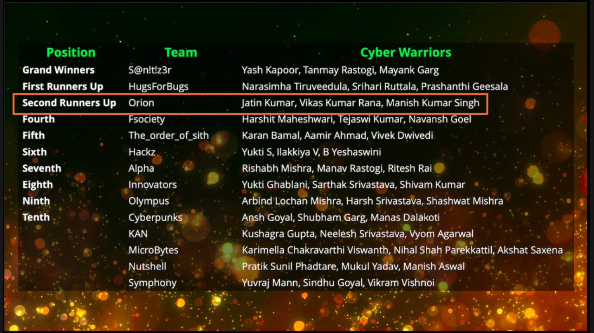

# **About me**

## **Intro**

I'm `Jatin Kumar`, a software engineer at [StepSecurity Inc](https://www.stepsecurity.io/), a cyber security startup focusing on software-supply-chain-security.

I work primarily on runtime-security agents that protect pipeline runners from real-world supply-chain attacks similar to SolarWinds and tj-actions incidents.

Outside of work, I spent time exploring new things, reading open source projects or experimenting with ideas.

Reach out to me

- LinkedIn: <https://www.linkedin.com/in/jatin-kumar-0a3755168>
- Email: <jatin.experiment001@gmail.com>

## **Experiences**

### **Software Engineer (Full-time) | [StepSecurity Inc.](https://www.stepsecurity.io/company)**

> :timer: **July-2023 to Present**

- Developed runtime-security agent for MacOS based machines using EndpointSecurity Framework and Network Filters for gaining visibility into process execution, file operations activity, DNS resolutions and network activity.

- Designed and owned eBPF‑based runtime agents that monitor process execution, DNS/IP‑level network activity, and file operations in
  CI/CD environments, and enforce runtime policies at DNS and IP levels to mitigate real‑world supply‑chain attacks.

- Implemented HTTPS traffic inspection subsystem using eBPF and Go in Kubernetes‑DaemonSet for intercepting plaintext traffic from
  OpenSSL, GnuTLS, Node.js and Go binaries without modifying the target application.

- Developed `eBPF-based armour` to detect/protect security-agents from tampering attacks.

- Developed a Kubernetes DaemonSet to deploy production eBPF‑based runtime security on [ARC-based](https://github.com/actions/actions-runner-controller) self‑hosted GitHub Actions runners, monitoring process, file, and network activity and enforcing DNS and network‑level policies using Cilium and Tetragon.
- Maintaining [Harden-Runner](https://github.com/step-security/harden-runner).

---

### **Software Developer (Part-Time) | [StepSecurity Inc.](https://www.stepsecurity.io/company)**

> :timer: **April-2022 to June-2023**

- Developed pattern‑based detection signatures on HTTPS telemetry to trigger real‑time alerts for anomalous CI/CD runner activity via
  email and Slack.

- Implemented `eBPF-based` HTTPS traffic interception capability in agent.

- Automated supply‑chain security best practices across GitHub Actions workflows, including dependency pinning (SHA256), least‑
  privilege GITHUB_TOKEN permissions, and CodeQL scanning, significantly reducing CI/CD attack surface.

- Implemented end‑to‑end integration tests to early catch regressions/errors in runtime‑security agent resulting in increased velocity of
  feature development and cutting new‑releases.

- Started contributing to [Harden-Runner](https://github.com/step-security/harden-runner).

## <!-- - Continued maintenance work on [runtime security agent](https://github.com/step-security/agent/pulls?q=is%3Apr+is%3Aclosed+author%3Ah0x0er) for CI/CD runners. -->

### **Software Developer (Intern) | [StepSecurity Inc.](https://www.stepsecurity.io/company)**

> :timer: **January-2022 to March-2022**

- Developed a [static analysis tool](https://github.com/step-security/secure-repo/tree/main/kbanalysis) using TypeScript, Node.js, and GitHub Actions to determine GITHUB_TOKEN permissions required by
  third‑party actions, reducing manual analysis time by up to 80%.

- Performed source‑code analysis of 50+ open‑source GitHub Actions to assess and document token permission requirements.

- Contributed [15+ pull requests](https://github.com/actions/starter-workflows/pulls?q=is%3Apr+is%3Aclosed+author%3Ah0x0er) to [GitHub Actions starter workflows](https://github.com/actions/starter-workflows), enforcing least‑privilege token permissions and improving security
  of downstream CI/CD usage.

## **Opensource Contributions**

### [**gojue/ecapture**](https://github.com/gojue/ecapture)

- [PR-882:](https://github.com/gojue/ecapture/pull/882) Identified and fixed `OOB-read` bug in gotls-tracing logic causing silent drop of kernel-events.
  - Bug report https://github.com/gojue/ecapture/issues/881

- [ISSUE-443:](https://github.com/gojue/ecapture/issues/433) Investigated memory-leak occurring in creating perCPUBuffer for eBPF sensors.

- [PR-438:](https://github.com/gojue/ecapture/pull/438) Reduced memory consumption in OpenSSL version detection logic by refactoring the existing logic to use fixed-buffer.

- [PR-426:](https://github.com/gojue/ecapture/pull/426) Extended support for capturing HTTPS traffic from stripped Go binaries resulting in improved inspection of traffic.
- [PR-418:](https://github.com/gojue/ecapture/pull/418) Implemented support for decoding kernel-space time received from eBPF event to user-space time resulting in accurate event-timestamp.

### [**ossf/scorecard**](https://github.com/ossf/scorecard})

- [PR-2278:](https://github.com/ossf/scorecard/pull/2278) Investigated and fixed a bug causing miscalculation of scores for private GitHub repositories.

### [**ossf/package-analysis**](https://github.com/ossf/package-analysis)

- [PR-978:](https://github.com/ossf/package-analysis/pull/978) Refactored static-analysis result struct to include SHA256 checksum of the target archive

## **Achievements**

### **Bug Hunting**

#### **Google VRP**

**Profile:** <https://bughunters.google.com/profile/1db4e6b5-400a-4250-8152-88c548e36f24>

**Valid Public Reports**

- <https://bughunters.google.com/reports/vrp/jALhjoMUo>
- <https://bughunters.google.com/reports/vrp/VZcSaHcyp>

### **Capture the Flags**

#### **AWS Proactive Security Spain CTF, March 2024**

- **Organizer:** AWS Spain
- **Position:** 5th

#### **AWS Proactive Security Spain CTF, Nov 2022**

- **Organizer:** AWS Spain
- **Position:** 2nd

#### **CyberKshetra'21, 2021**

- **Organizer:** Deloitte
- **Position:** 3rd

<!-- !!! note
    **`Unnamed Memories` is a centralized repo of my notes, logs, experiences and more.** -->
