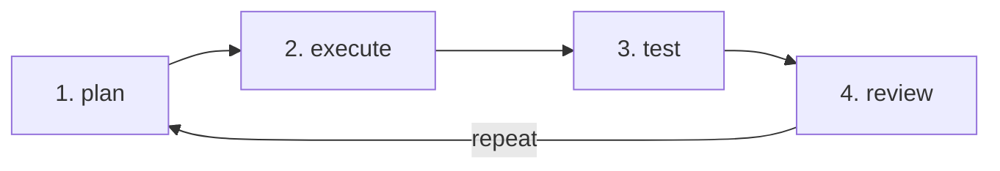

## how to do agentic coding 

coding agent loop:

- plan
- execute
- test
- review

before planning, create a task/spec file with following info

- define the objective or task or goal
- define what is expected, what needs to be done
- define how it should be done, what are the constraints

## what is agentic-engineering

- https://zed.dev/agentic-engineering
- https://simonwillison.net/guides/agentic-engineering-patterns/what-is-agentic-engineering/

## refs

- https://www.dbreunig.com/2026/05/04/10-lessons-for-agentic-coding.html
- https://lucumr.pocoo.org/2025/6/12/agentic-coding/
- https://sourcegraph.com/blog/agentic-coding
- https://claude.com/blog/introduction-to-agentic-coding
- https://cursor.com/help/ai-features/agentic-coding
- https://agentic-coding.github.io/
- about loop: https://blogs.oracle.com/developers/the-agent-loop-decoded-three-levels-every-agent-engineer-must-know
- https://github.com/jordimas/awesome-agentic-engineering
